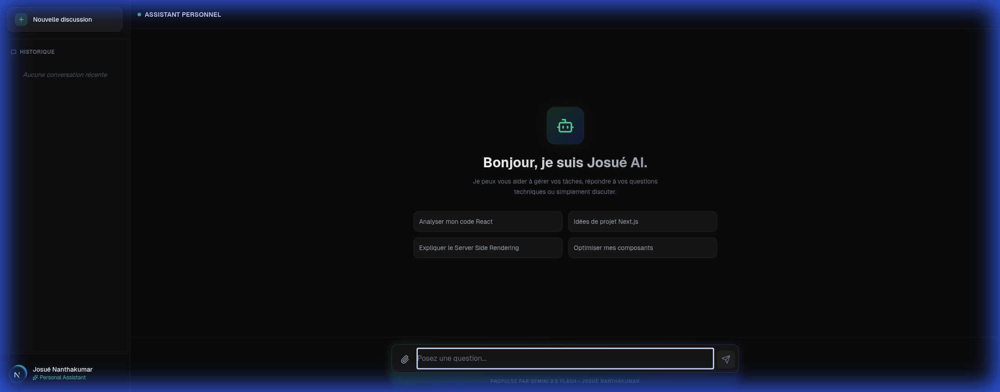

# 🚀 Assistant IA SAAS - Next.js & Gemini




**SaaS-Ready AI Assistant** est une solution d'assistant conversationnel moderne, conçue pour démontrer une expertise en développement web et intégration d'IA. Construit avec **Next.js 14** et **Google Gemini**, ce projet sert de base solide pour des applications d'entreprise, alliant performance, design premium et fonctionnalités avancées.

## ✨ Fonctionnalités Clés

- **🧠 Intelligence Artificielle Avancée** : Propulsé par le modèle Google Gemini 2.5 Flash pour des réponses précises et contextuelles.
- **⚡ Streaming Temps Réel** : Génération de réponse instantanée avec affichage progressif (streaming).
- **💾 Historique de Conversation** : Sauvegarde automatique locale (`localStorage`) pour ne jamais perdre le contexte.
- **🎨 UI/UX Premium** :
    - **Design Glassmorphism** : Esthétique moderne avec effets de transparence et flou.
    - **Dark Mode Natif** : Optimisé pour le confort visuel.
    - **Responsive** : Expérience fluide sur Mobile, Tablette et Desktop.
- **🛑 Contrôle Total** : Possibilité d'arrêter la génération à tout moment.
- **📋 Productivité** : Copie rapide des messages et blocs de code en un clic.
- **🚀 Prêt pour le SaaS** : Architecture propre et extensible.

## 🛠️ Stack Technique

- **Framework** : [Next.js 14](https://nextjs.org/) (App Router)
- **Langage** : [TypeScript](https://www.typescriptlang.org/)
- **Style** : [Tailwind CSS](https://tailwindcss.com/) + `clsx` + `tailwind-merge`
- **AI SDK** : [Vercel AI SDK](https://sdk.vercel.ai/docs)
- **Icônes** : [Lucide React](https://lucide.dev/)

## 🚀 Installation

### Prérequis

- Node.js 18+
- Clé API Google AI Studio

### Étapes

1.  **Cloner le dépôt**
    ```bash
    git clone https://github.com/JosueNANTHAKUMAR/Chatbox.git
    cd Chatbox
    ```

2.  **Installer les dépendances**
    ```bash
    npm install
    ```

3.  **Configurer l'environnement**
    Créez un fichier `.env.local` à la racine :
    ```env
    GOOGLE_GENERATIVE_AI_API_KEY=votre_clé_api_ici
    ```

4.  **Lancer le serveur de développement**
    ```bash
    npm run dev
    ```

    Ouvrez [http://localhost:3000](http://localhost:3000) pour voir l'application.

## 🔮 Roadmap (Évolutions possibles)

- [ ] **Intégration RAG** : Connexion à des documents d'entreprise (PDF, Notion).
- [ ] **Mode Vocal** : Synthèse vocale et reconnaissance vocale.
- [ ] **Exécution de Code** : Lancer des scripts Python/JS directement dans le chat.
- [ ] **Authentification** : Intégration avec NextAuth / Clerk.

---

*Conçu & Développé par [Josué Nanthakumar](https://github.com/JosueNANTHAKUMAR).*
